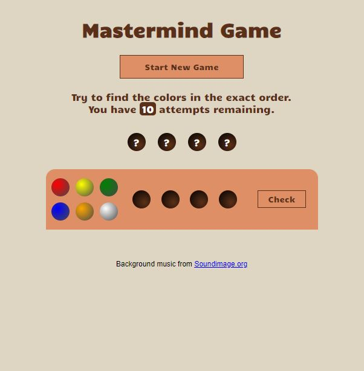
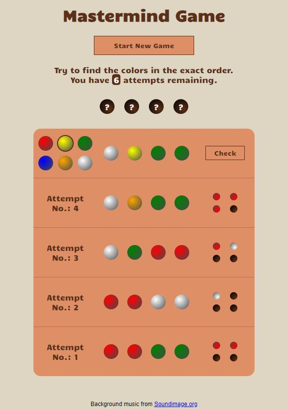
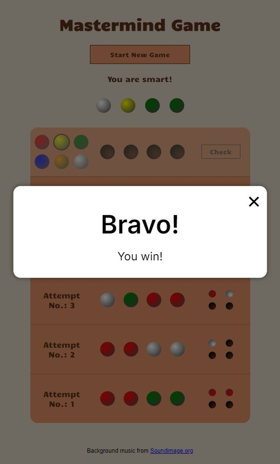

# Mastermind Game (code breaker)

Mastermind is a classic logic game. The code will be generated randomly, and the player have to guess the secret code to win.

### Screenshots
Here are some screenshots from of the game:

*Mastermind game start screenshot*

*Mastermind game after 4 attempts screenshot*

*Mastermind game at win case screenshot*

### Tech/Framework used

#### This game was developed using:
* HTML
* CSS
* JavaScript

### Features

This game provide a user friendly interface where the player needs to move the mouse in a horizontal line: to select the color, place it in a hole, and click check button.

Also, a background sound and some sound effects have been added to this game.

Moreover some visualizations were added to give the player more ideas about what's going, what color is selected, if he can click the button, and a tooltip on the button to let him know the reason why he could not click.

### How to Play?

First, It's better to click on **"Start New Game"** button in the beganing, because the browser will not allow the game to run background sounds whithout clicking a button.

Then, it's simple, try to guess **the code** (the four colors) in the same sequence.

Simply, click on the color you want from the set of colors on the left of the board, and place it by clicking on the position you want in the in the middel of the board.

finally, after filling all four holes with colors, click on **Check** button. A new row will be added to the board contains the number of attempts you tried, the set of colors you select, and the feedback - or the result - of your attempt.

Repeate till you guess the secret code.

> **_Note:_** You have only 10 attempts.

#### Feedback colors:
* Each **Red point** means a correct color in acorrect place.
* Each **White point** means a correct color in a wrong place.
* Each **Empty** means wrong color.
> **_Note:_** The order of the white and red points does not matter.

### Contribute
 Many thanks to Michle, Ali, Ahlam for there guide and support.
 Also, thank you to my colleagues Jasim, Mohsen for there feedback and sugsuggestions.

### Credits

Background music and sound FX from [Soundimage.org](https://soundimage.org/)

